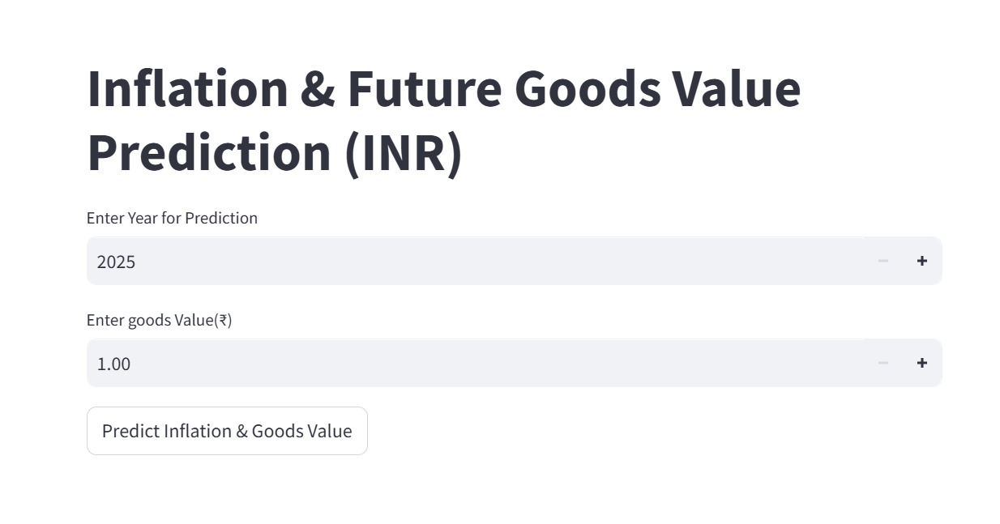
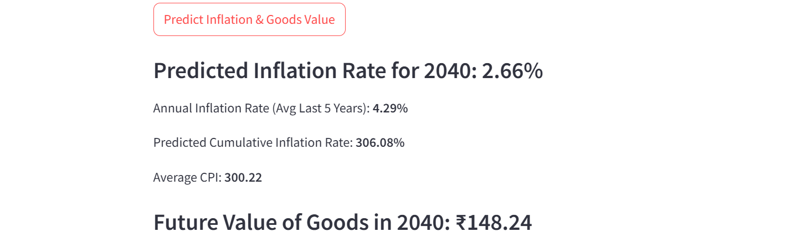
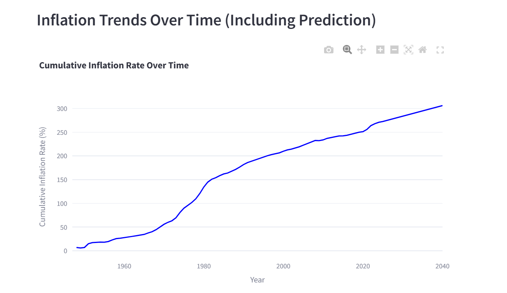

# Inflation_trends
A Streamlit web app that predicts future inflation rates and calculates money value based on historical data. Uses a trained machine learning model with data fetched from Google Big query.

# Inflation Trends Streamlit App

This project provides predictions for inflation trends using machine learning. The app is live and can be accessed using the link below:

# Live Streamlit App:
Click here to visit the app
https://inflation-trends.streamlit.app/

